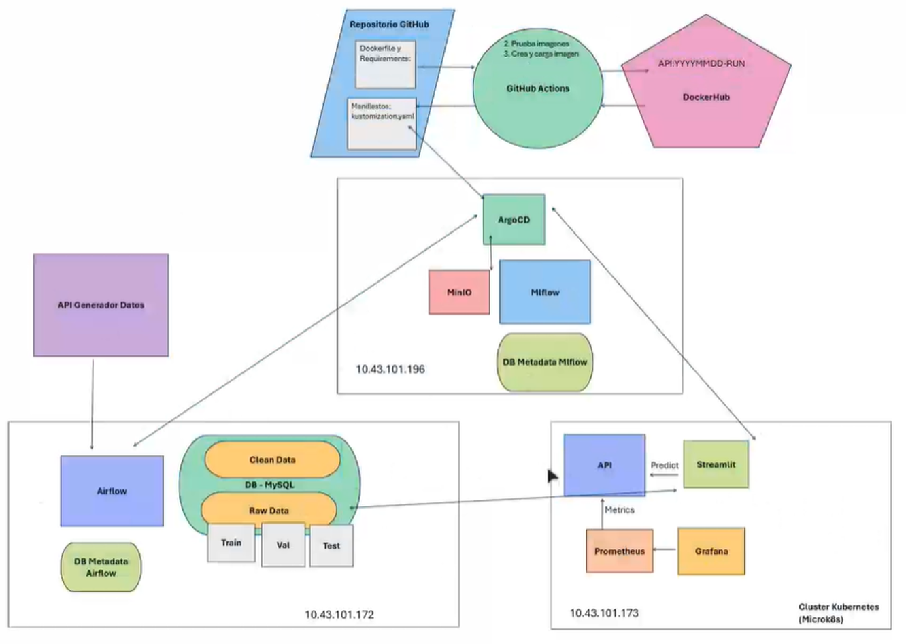

# 🧠 Descripción General del Proyecto

Este proyecto implementa una solución completa de MLOps distribuida en tres servidores, diseñada para gestionar todo el ciclo de vida de un modelo de machine learning que predice precios de propiedades inmobiliarias.

La arquitectura del proyecto está basada en contenedores Docker orquestados con Kubernetes (MicroK8s) y está organizada en tres entornos funcionales independientes, desplegados en máquinas virtuales diferentes:

- **Servidor 1**: Encargado del preprocesamiento automático de datos con Apache Airflow.
- **Servidor 2**: Responsable del registro de experimentos y gestión de artefactos con MLflow y MinIO.
- **Servidor 3**: Despliega el modelo en producción mediante una API con FastAPI, integra monitoreo con Prometheus & Grafana, pruebas de carga con Locust y una interfaz de usuario con Streamlit.

Este enfoque modular permite escalar y mantener cada componente de forma independiente, emulando un entorno real de producción distribuido.

> 💡 El objetivo principal es proporcionar predicciones precisas de precios inmobiliarios mediante un sistema MLOps completo, permitiendo a los usuarios obtener estimaciones basadas en características de las propiedades.

---

## 🗂️ Distribución del Proyecto por Servidores

Este proyecto fue desarrollado colaborativamente y distribuido en tres máquinas virtuales, cada una encargada de un componente clave del flujo de trabajo MLOps. Cada servidor tiene su propio `README.md` con detalles técnicos y operativos específicos:

| Servidor | Rol Principal                                   | Enlace al Detalle |
|----------|--------------------------------------------------|-------------------|
| 🟦 Servidor 1 | Preprocesamiento de datos con Airflow           | [Ver README Servidor 1](./Servidor1/README.md) |
| 🟩 Servidor 2 | Seguimiento de experimentos con MLflow y MinIO  | [Ver README Servidor 2](./Servidor2/README.md) |
| 🟥 Servidor 3 | Despliegue, monitoreo y pruebas de inferencia   | [Ver README Servidor 3](./Servidor3/README.md) |

Cada una de estas secciones incluye:
- Los contenedores desplegados.
- Los DAGs y notebooks asociados.
- Instrucciones de uso y pruebas.

> 📌 **Nota:** Todos los servidores están conectados en red local y comparten el acceso a la base de datos y el almacenamiento distribuido configurado para simular un entorno de producción real.

---

## 🧱 Arquitectura General del Proyecto

El proyecto está distribuido en **tres servidores (máquinas virtuales)** que trabajan de manera coordinada para implementar un pipeline completo de MLOps. Cada servidor aloja componentes específicos de la arquitectura, asegurando modularidad, escalabilidad y claridad en la implementación.

A continuación se presenta el diagrama de la arquitectura general:



### 🔹 Servidor 1 – Preprocesamiento y Almacenamiento de Datos
- **Airflow**: Orquestación de pipelines de preprocesamiento y entrenamiento.
- **Base de Datos MySQL**: Almacena datos en dos capas:
  - `RawData`: Datos crudos separados en train, validation y test.
  - `CleanData`: Datos preprocesados listos para entrenamiento.
- **DAGs**:
  - `realtor_price_model.py`: Preprocesamiento, entrenamiento y registro del modelo de precios inmobiliarios.

### 🔸 Servidor 2 – Seguimiento de Experimentos
- **MLflow Tracking Server**: Registro de métricas, parámetros y artefactos.
- **MinIO**: Almacenamiento compatible con S3 para guardar artefactos de modelos.
- **PostgreSQL Metadata**: Almacena la metadata generada por MLflow.
- Imagen personalizada de MLflow desplegada con dependencias para conectividad segura.

### 🔺 Servidor 3 – Despliegue, Observabilidad y Experiencia de Usuario
- **FastAPI**: API de inferencia conectada al modelo en producción desde MLflow.
- **Streamlit**: Interfaz gráfica para realizar predicciones desde la web.
- **Prometheus + Grafana**: Monitoreo del comportamiento de la API:
  - Latencia, uso de memoria, conteo de inferencias.

> 🧩 Cada componente se desplegó como un contenedor independiente y, cuando están en el mismo clúster, se conectan mediante redes virtuales internas. Los puertos se exponen a través de NodePort para que puedan comunicarse por IP con otras máquinas. Las IP asignadas por el clúster a cada servidor garantizan el enrutamiento correcto entre servicios.

---
## 🛠️ Tecnologías y Componentes Utilizados

El proyecto se compone de varios microservicios, cada uno desplegado en contenedores independientes, comunicados entre sí dentro de un entorno orquestado con Kubernetes:

- **MLflow**: Gestión de experimentos y modelos. Conectado a MinIO (artefactos) y MySQL (metadatos).
- **Airflow**: Orquestación de pipelines de preprocesamiento y entrenamiento.
- **MinIO**: Almacenamiento local de artefactos, compatible con S3.
- **MySQL**: Bases de datos para RawData, CleanData.
- **PostgreSQL**: Base de datos para metadata de MLflow y Airflow.
- **FastAPI**: API de inferencia del modelo en producción.
- **Streamlit**: Interfaz gráfica para predicciones del modelo.
- **Prometheus + Grafana**: Observabilidad y monitoreo de métricas de inferencia.

## Integración Continua

### CI/CD Airflow (workflowservidor1)

Este workflow se activa en cada push a la rama `main` que modifique archivos dentro de `Servidor1/airflow/**` o el `docker-compose.yaml` en `Servidor1/`. También puede lanzarse manualmente con `workflow_dispatch`.

1. **Checkout del repositorio**  
   - Clona todo el código para garantizar acceso a los archivos de Airflow y al `docker-compose.yaml`.

2. **Definir `IMAGE_TAG`**  
   - Genera un tag semántico con la fecha y el número de ejecución (`YYYYMMDD-runNumber`) y lo almacena en la variable de entorno `IMAGE_TAG`.

3. **Login en Docker Hub**  
   - Usa las credenciales guardadas en los secretos (`DOCKERHUB_USER`, `DOCKERHUB_TOKEN`) para iniciar sesión.

4. **Build de imagen Airflow (carga local)**  
   - Construye la imagen usando como contexto `Servidor1/airflow`.  
   - Etiqueta la imagen como `${{ secrets.DOCKERHUB_USER }}/airflow:${{ IMAGE_TAG }}` y la carga en el daemon local para pruebas.

5. **Smoke-test: regresión**  
   - Ejecuta un contenedor con la nueva imagen e importa un pequeño DataFrame, entrena un modelo de regresión lineal.  
   - Verifica que la forma de los valores coincida con el DataFrame. Si todo está correcto, imprime `✅ Entrenamiento`.  
   - Si falla, detiene el workflow evitando que se publique una imagen defectuosa.

6. **Push de imagen validada a Docker Hub**  
   - Si el smoke-test pasa, recompila la imagen (misma ruta) pero con `push: true` para subirla a Docker Hub usando la etiqueta definida.

7. **Actualizar `Servidor1/.env`**  
   - Crea (o modifica) el archivo `Servidor1/.env`.  
   - Actualiza (o agrega) la variable `REPO_AIRFLOW` con `${{ secrets.DOCKERHUB_USER }}/airflow`.  
   - Actualiza (o agrega) la variable `IMAGE_TAG` con el valor de `${{ IMAGE_TAG }}`.

8. **Commit & Push de `Servidor1/.env`**  
   - Configura el nombre y correo de Git para el commit.  
   - Hace `git pull --rebase --autostash origin main` para integrar cambios remotos.  
   - Si hay modificaciones en `Servidor1/.env`, las commitea con el mensaje `chore: actualizar Servidor1/.env con tag ${{ IMAGE_TAG }}` y las empuja a la rama `main`.  
   - Así, el entorno de producción recogerá automáticamente la nueva imagen desde la variable `IMAGE_TAG`.

---

### CI/CD Servidor2 (workflowservidor2)

Este workflow se dispara en cada push a `main` que afecte rutas bajo `Servidor2/mlflow/**` o `Servidor2/k8s/**`.

1. **Checkout completo**  
   - Clona todo el repositorio con `fetch-depth: 0` para conservar el historial completo. Esto es necesario al hacer pull/rebase en pasos posteriores.

2. **Definir `IMAGE_TAG`**  
   - Genera un tag semántico `YYYYMMDD-runNumber` y lo guarda en `IMAGE_TAG`.

3. **Build imagen de MLflow**  
   - Construye la imagen Docker usando el Dockerfile en `Servidor2/mlflow`.  
   - La etiqueta como `${{ secrets.DOCKERHUB_USER }}/mlflow-custom:${{ IMAGE_TAG }}`.

4. **Login a Docker Hub**  
   - Se autentica con las credenciales de Docker Hub guardadas en los secretos.

5. **Push de imagen**  
   - Sube la imagen `mlflow-custom:${{ IMAGE_TAG }}` a Docker Hub.

6. **Actualizar Kustomization**  
   - Ingresa a `Servidor2/k8s` y ejecuta `kustomize edit set image` para apuntar la imagen de MLflow a `${{ secrets.DOCKERHUB_USER }}/mlflow-custom:${{ IMAGE_TAG }}`.

7. **Commit de cambios en `kustomization.yaml`**  
   - Configura nombre y correo de Git.  
   - Hace `git pull --rebase --autostash origin main` para integrar posibles cambios remotos.  
   - Si detecta modificaciones en `kustomization.yaml`, las committea con el mensaje `chore: actualizar imagen mlflow-custom ${{ IMAGE_TAG }}` y las empuja a la rama `main`.  
   - De esta manera, el despliegue en Kubernetes mediante Kustomize usará la nueva imagen de MLflow.

---

### CI/CD Servidor3 (workflowservidor3)

Este workflow cubre cuatro componentes (Grafana, Prometheus, Streamlit y FastAPI) y se activa en cada push a `main` que modifique archivos en cualquiera de estas rutas:

- `Servidor3/grafana/**`  
- `Servidor3/prometheus/**`  
- `Servidor3/streamlit/**`  
- `Servidor3/fastapi/**`  
- `Servidor3/k8s/**`

1. **Checkout completo**  
   - Clona todo el repositorio con `fetch-depth: 0` para conservar el historial y permitir pull/rebase.

2. **Definir `IMAGE_TAG`**  
   - Genera el tag semántico `YYYYMMDD-runNumber` y lo asigna a `IMAGE_TAG`.

3. **Build de imágenes Docker**  
   - Construye, en un solo paso, las siguientes imágenes:  
     - `${{ secrets.DOCKERHUB_USER }}/grafana:${{ IMAGE_TAG }}` (contexto: `Servidor3/grafana`)  
     - `${{ secrets.DOCKERHUB_USER }}/prometheus:${{ IMAGE_TAG }}` (contexto: `Servidor3/prometheus`)  
     - `${{ secrets.DOCKERHUB_USER }}/streamlit-app:${{ IMAGE_TAG }}` (contexto: `Servidor3/streamlit`)  
     - `${{ secrets.DOCKERHUB_USER }}/fastapi:${{ IMAGE_TAG }}` (contexto: `Servidor3/fastapi`)

4. **Login en Docker Hub**  
   - Se autentica usando los secretos de Docker Hub.

5. **Push de imágenes**  
   - Sube las cuatro imágenes con la etiqueta `${{ IMAGE_TAG }}` a Docker Hub.

6. **Actualizar Kustomization en Kubernetes**  
   - Entra a `Servidor3/k8s` y ejecuta los siguientes comandos para cada servicio:  
     ```bash
     kustomize edit set image ${{ secrets.DOCKERHUB_USER }}/grafana:${{ IMAGE_TAG }}
     kustomize edit set image ${{ secrets.DOCKERHUB_USER }}/prometheus:${{ IMAGE_TAG }}
     kustomize edit set image ${{ secrets.DOCKERHUB_USER }}/streamlit-app:${{ IMAGE_TAG }}
     kustomize edit set image ${{ secrets.DOCKERHUB_USER }}/fastapi:${{ IMAGE_TAG }}
     ```

7. **Commit de cambios en `kustomization.yaml`**  
   - Configura el nombre y correo de Git.  
   - Hace `git pull --rebase --autostash origin main` para integrar cambios remotos.  
   - Si hay modificaciones en `kustomization.yaml`, las agrega al staging, committea con el mensaje `chore: actualizar imágenes a tag ${{ IMAGE_TAG }}` y las empuja a la rama `main`.  
   - Así, al aplicar Kustomize en el clúster, se desplegarán automáticamente las nuevas versiones de Grafana, Prometheus, Streamlit y FastAPI.

---


### Resumen de la lógica general

- Cada workflow reacciona automáticamente a cambios en su carpeta correspondiente dentro de `Servidor1`, `Servidor2` o `Servidor3`.
- Genera un **tag único** para la imagen basado en la fecha (`YYYYMMDD`) y el número de corrida de GitHub Actions (`run_number`).
- **Construye** la imagen Docker para el servicio afectado (Airflow, MLflow, Grafana, Prometheus, Streamlit, FastAPI).
- Se **loguea** en Docker Hub y hace **push** de la imagen recién construida con la etiqueta generada.
- Actualiza el archivo de configuración (`.env` o `kustomization.yaml`) que identifica qué imagen usar en producción.
- Hace **commit & push** de ese cambio para que el despliegue en Producción (ya sea Airflow o Kubernetes) consuma automáticamente la nueva versión.

De esta forma, cualquier cambio en el código fuente desencadena el pipeline de CI/CD, garantizando que la imagen Docker se construya, pruebe mínimamente (en el caso de Airflow) y se despliegue de manera coherente y automatizada.

   

## Despliegue Continuo con ArgoCD

En este proyecto utilizamos **ArgoCD** para que, al detectar cambios en GitHub, sincronice automáticamente los manifiestos de Kubernetes con los tres clusters (Servidor1, Servidor2 y Servidor3). Cada “Application” de ArgoCD hace lo siguiente:


- **servidor1-mlops**  
  - Monitorea la carpeta `Servidor1/kubernetes` en la rama `main`.  
  - Al encontrar cambios, aplica los manifiestos en el cluster de Servidor1.  
  - Las imágenes referenciadas en los YAML se obtienen de Docker Hub.

- **Servidor2-Mlops**  
  - Monitorea la carpeta `Servidor2/k8s` en la rama `main`.  
  - Cada cambio se aplica “in-cluster” en Servidor2 (namespace `mlops`).  
  - Las imágenes Docker provienen de Docker Hub.

- **servidor3-mlops**  
  - Monitorea la carpeta `Servidor3/k8s` en la rama `main`.  
  - Al detectar actualizaciones, sincroniza los recursos en el cluster de Servidor3.  
  - También descarga las imágenes desde Docker Hub según las etiquetas en los YAML.


Cada vez que se hace push a `main` y hay modificaciones en la carpeta correspondiente, ArgoCD:  
1. Descarga los archivos YAML del repositorio.  
2. Compara con el estado actual del cluster.  
3. Crea, actualiza o elimina recursos para que el cluster coincida con Git.  

De esta forma, los despliegues quedan automatizados y sincronizados con las imágenes publicadas en Docker Hub.  

## Detalle de cada tarea en el DAG `realtor_price_model`

A continuación se describen de manera concisa y concreta las acciones que realiza cada tarea:


1. **`extract_data`**  
   - Llama al endpoint `GET /data?group_number=7&day=Tuesday`.  
   - Si la respuesta HTTP es 200 y el JSON contiene filas (`payload["data"]` o lista directa), convierte esas filas en un DataFrame de pandas y las inserta—con una marca de tiempo (`fetched_at`)—en la tabla `realtor_raw` de la base de datos RawData.  
   - Si recibe un error HTTP 400 con el mensaje `"Ya se recolectó toda la información mínima necesaria"`, marca en XCom `finished=True` (fin de datos).  
   - En cualquier caso, registra en XCom dos valores:  
     - `new_records`: número de filas nuevas insertadas.  
     - `finished`: booleano que indica si se llegó al fin de la fuente de datos.

2. **`branch_on_exhaustion`**  
   - Lee `finished` desde XCom (resultado de `extract_data`).  
   - Si `finished=True`, dirige el flujo a la tarea `reset_data`.  
   - Si `finished=False`, dirige el flujo a `decide_to_train`.  
   - Esto se hace mediante un `BranchPythonOperator` que devuelve el `task_id` correspondiente (`"reset_data"` o `"decide_to_train"`).

3. **`reset_data`**  
   - Llama al endpoint `GET /restart_data_generation?group_number=7&day=Tuesday` para reiniciar la generación de datos en la fuente externa.  
   - Conecta a las bases RawData y CleanData usando las URIs `AIRFLOW_CONN_MYSQL_DEFAULT` y `AIRFLOW_CONN_MYSQL_CLEAN`.  
   - Inspecciona las tablas en ambas bases y ejecuta `TRUNCATE TABLE` en cada una de estas tablas **solo si existen**:  
     - En RawData: `realtor_raw`, `train`, `validation`, `test`.  
     - En CleanData: `train_clean`, `validation_clean`, `test_clean`.  
   - El propósito es vaciar por completo los datos históricos para comenzar una nueva recolección.

4. **`end_after_reset`**  
   - Operador vacío (`EmptyOperator`) que marca el final de la rama “reset”.  
   - Su única función es actuar como punto de convergencia hacia la tarea `end`.

5. **`decide_to_train`**  
   - Recupera `new_records` desde XCom.  
   - Configura MLflow (URI de tracking, experimento `"Realtor_Price_Experiment"`).  
   - Si `new_records == 0`, registra en MLflow métricas y tags (`decision="end_no_train"`, `reason="0 new records"`) y retorna `"end_no_train"` → no se entrena.  
   - Si `new_records > 0`, lee las últimas `new_records` filas de la tabla `realtor_raw` y valida columnas obligatorias (`status`, `bed`, `bath`, `acre_lot`, `house_size`, `prev_sold_date`, `price`):  
     - Si faltan columnas o hay valores nulos o formatos fuera de rango, registra tags en MLflow (`decision="end_no_train"`, razón de invalidación) y retorna `"end_no_train"`.  
     - Si no hay invalidaciones y `new_records > 10000`, registra tags en MLflow (`decision="split_data"`, razón `"X nuevos > 10000"`) y retorna `"split_data"`.  
     - En cualquier otro caso (`new_records > 0` pero ≤ 10000), registra tags en MLflow (`decision="end_no_train"`, razón `"X nuevos ≤ 10000"`) y retorna `"end_no_train"`.  
   - En resumen, decide si conviene ejecutar entrenamiento (solo si hay más de 10 000 registros nuevos y la validación preliminar pasa) o finalizar sin entrenar.

6. **`end_no_train`**  
   - Operador vacío (`EmptyOperator`) para la rama donde no se entrena.  
   - Su función es actuar como punto de unión hacia la tarea `end`.

7. **`split_data`**  
   - Conecta a la base RawData (`AIRFLOW_CONN_MYSQL_DEFAULT`) y lee **todo** el contenido de la tabla `realtor_raw`.  
   - Si la tabla está vacía, no hace nada y sale.  
   - Si hay datos, los mezcla aleatoriamente (`df.sample(frac=1, random_state=42)`) y reparte en proporciones 60/20/20:  
     - Primer 60 % → `train`  
     - Siguiente 20 % → `validation`  
     - Último 20 % → `test`  
   - Sobrescribe (o crea) las tres tablas en RawData: `train`, `validation` y `test` con los DataFrames correspondientes.  
   - El objetivo es preparar los datos crudos en splits para entrenamiento y validación.

8. **`preprocess_data`**  
   - Lee los tres splits recién generados (`train`, `validation`, `test`) de RawData.  
   - Define internamente la función `_prep(df)` que realiza:  
     1. Relleno de valores nulos en columnas numéricas (`bed`, `bath`, `acre_lot`, `house_size`, `price`) usando forward fill y luego 0.  
     2. Cálculo de `days_since_last_sale`: convierte `prev_sold_date` a datetime, resta a la fecha actual UTC y extrae el número de días; nulos pasan a –1.  
     3. One-hot encoding de la columna categórica `status`, eliminando una categoría de referencia.  
     4. Eliminación de columnas de alta cardinalidad (`brokered_by`, `street`, `zip_code`, `city`, `state`, `prev_sold_date`, `fetched_at`).  
     5. Reordenar columnas para que `price` quede siempre al final.  
   - Aplica `_prep` a cada split crudo (`train`, `validation`, `test`) y obtiene DataFrames limpios (`train_clean`, `validation_clean`, `test_clean`).  
   - Conecta a la base CleanData (`AIRFLOW_CONN_MYSQL_CLEAN`) y sobrescribe (o crea) las tres tablas limpias: `train_clean`, `validation_clean`, `test_clean`.  
   - De este modo, prepara los datos finales que se usarán en el paso de entrenamiento.

9. **`train_and_register`**  
   - Lee `train_clean`, `validation_clean` y `test_clean` desde CleanData.  
   - Separa características (`X_*`) y etiqueta (`y_* = price`) para cada split.  
   - Configura MLflow (URI de tracking, experimento `"Realtor_Price_Experiment"`).  
   - Define la lista de valores de alpha a probar en un modelo Ridge: `[0.01, 0.1, 1.0, 10.0, 100.0]`.  
   - Construye `all_cols = unión de todas las columnas presentes en los tres splits` para asegurar consistencia al reindexar.  
   - **Primera fase (búsqueda de mejor alpha)**:  
     1. Para cada valor de alpha, entrena sobre `X_train_raw.reindex(columns=all_cols, fill_value=0)` → `y_train`.  
     2. Predice sobre `X_val_raw.reindex(columns=all_cols, fill_value=0)` → calcula `val_rmse`.  
     3. Registra en MLflow la métrica `val_rmse_alpha_{α}`.  
     4. Mantiene el alpha que minimiza `val_rmse` (mejor alpha en validación).  
   - **Segunda fase (modelo final)**:  
     1. Concatena `train` + `validation` para reentrenar sobre todo (`df_trval`, `y_trval`).  
     2. Reindexa a `all_cols`, entrena final con `best_alpha`.  
     3. Predice sobre `test` (`X_test_raw.reindex(columns=all_cols, fill_value=0)`), calcula `test_rmse`.  
     4. En el mismo run de MLflow, registra métricas: `best_val_rmse`, `test_rmse` y parámetro `best_alpha`. También guarda el modelo entrenado en el registro de MLflow como `RealtorPriceModel`.  
   - **Promoción a producción**:  
     1. Consulta en MLflow (usando `MlflowClient`) las corridas anteriores excluyendo la actual, ordenadas por `test_rmse` ascendente.  
     2. Si no hay corrida previa o el `test_rmse` actual es mejor que el mejor previo, marca `promoted=True`.  
     3. Reabre el run actual en MLflow y añade tags de orquestación (`dag_run_id`, `execution_date`, `previous_best_rmse`, `current_rmse`, `promoted`).  
     4. Si `promoted=True`, transiciona la versión del modelo recién registrada a **Production** y archiva versiones anteriores en MLflow.  
   - Con esta lógica, se entrena un modelo robusto, se registra en MLflow y solo se promueve si mejora el RMSE en test respecto a todas las ejecuciones anteriores.

10. **`end`**  
    - Operador vacío (`EmptyOperator`) con `trigger_rule=NONE_FAILED_MIN_ONE_SUCCESS`.  
    - Punto de convergencia final en el DAG; se ejecuta si al menos una de las ramas (reset o entrenamiento) finalizó sin errores.  
    - No realiza ninguna acción adicional.

---

### Resumen de Flujo

- **Inicio** → `extract_data`  
- **Evaluar fin de datos** → `branch_on_exhaustion`  
  - Si `finished=True` → `reset_data` → `end_after_reset` → `end`  
  - Si `finished=False` → `decide_to_train`  
    - Si decisión = `"end_no_train"` → `end_no_train` → `end`  
    - Si decisión = `"split_data"` → `split_data` → `preprocess_data` → `train_and_register` → `end`

De esta forma, el DAG cubre tres caminos principales:

1. **Reset** (cuando se agotó la fuente): se reinicia la generación de datos y se vacían tablas.  
2. **No-Train** (si no hay o no alcanza datos nuevos): se termina sin entrenamiento.  
3. **Train** (si hay suficientes datos válidos): división, preprocesamiento, entrenamiento, registro y posible promoción del modelo.  

## MLflow: Experimento “Realtor_Price_Experiment”

- Todos los runs (tanto las decisiones como los entrenamientos) se guardan bajo el experimento **Realtor_Price_Experiment**.  
- En la UI de MLflow se ven dos tipos de runs:  
  1. **Decisiones** (“decision”): se registran con tags que indican la razón (por ejemplo, `decision = end_no_train`, `reason = "0 new records"`).  
  2. **Entrenamientos** (“train_manual_YYYY-MM-DD…”): muestran las métricas (RMSE en validación y test), el modelo entrenado (en el Model Registry) y tags de orquestación (por ejemplo, `best_alpha`, `current_rmse`, `promoted`).
  


- Cada run almacena:  
  - **Tags** (razones de decisión o metadatos del DAG).  
  - **Métricas** (solo en entrenamientos).  
  - **Modelo serializado** (solo en entrenamientos) que luego puede marcarse como “Production” si mejora el desempeño.
 


## 3. Observabilidad y Monitorización

Integramos Streamlit, Prometheus y Grafana para ofrecer una vista unificada de predicciones, métricas y dashboards.

### 3.1 Panel de Streamlit (Inferencia y Historial)
- **Objetivo**:
  - Ingresar características de una propiedad y obtener la **predicción estimada** (por ejemplo: `$245,706.06`).
  - Mostrar el **modelo en producción** (por ejemplo: “versión 9”).
  - Presentar un **historial tabulado** con todas las corridas del DAG:
    - **Dag_Run_ID**
    - **Decision** (`split_data`, `end_no_train`, etc.)
    - **Decision Reason**
    - **Model name** (solo si se entrenó)
    - **Model Version** (solo si se promovió)
    - **Current Rsme** y **Previous Rsme** (si aplican)
    - **Promoted** (`true` / `false`)


### 3.2 Prometheus (Scrape de Métricas)
- **Objetivo**:
  - Recopilar métricas de la API de inferencia (FastAPI) y de Prometheus.
  - Configuración básica en `prometheus.yml`:

- **Métricas Recopiladas**:
  - **Tasa de peticiones de inferencia** (`requests_per_second`)
  - **Latencia de inferencia** (percentil 95: `p95_latency_seconds`)
  - Métricas internas de Prometheus (uso de CPU, memoria, etc.)


### 3.3 Grafana (Dashboards de Métricas)
- **Objetivo**:
  - Visualizar en tiempo real las métricas recolectadas por Prometheus.
  - Paneles sugeridos:
    - **Tasa de peticiones de inferencia (peticiones/segundo)**
    - **P95 de latencia de inferencias (segundos)**


## 🚀 ¿Cómo ejecutar el proyecto completo?
✅ Asegúrate de que los 3 servidores estén activos, conectados en la misma red y con Kubernetes (MicroK8s) habilitado.

🔌 Paso a paso por servidor
🖥️ Servidor 1 — Preprocesamiento y orquestación

```bash
kubectl apply -f Servidor1/kubernetes/
```
Accede a Airflow y ejecuta el DAG realtor_price_model.py.

🗃️ Servidor 2 — Almacenamiento y MLflow

```bash
docker build -t custom-mlflow:latest .
docker tag custom-mlflow:latest localhost:32000/custom-mlflow:latest
docker push localhost:32000/custom-mlflow:latest
kubectl apply -f Servidor2/kubernetes/
kubectl apply -f Servidor2/kubernetes/create-minio-bucket.yaml
```

📡 Servidor 3 — Inferencia, monitoreo y UI

```bash
kubectl apply -f Servidor3/kubernetes/
```

Accede a la API o interfaz de Streamlit para hacer predicciones.
Verifica métricas en Prometheus y visualízalas en Grafana.
