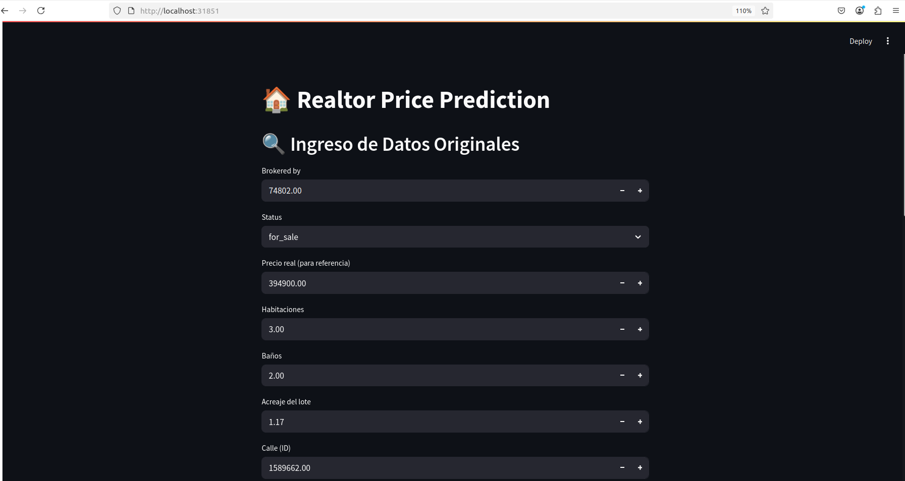
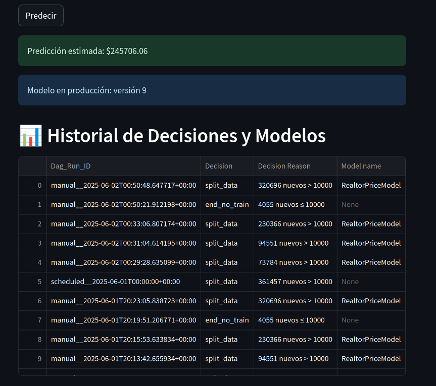
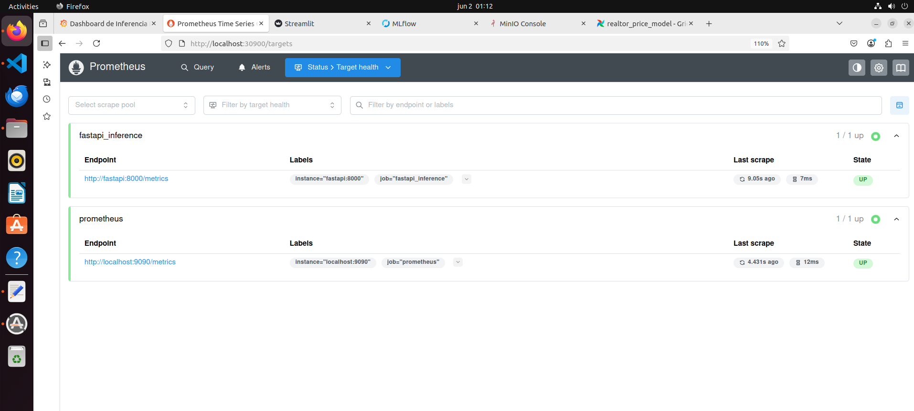
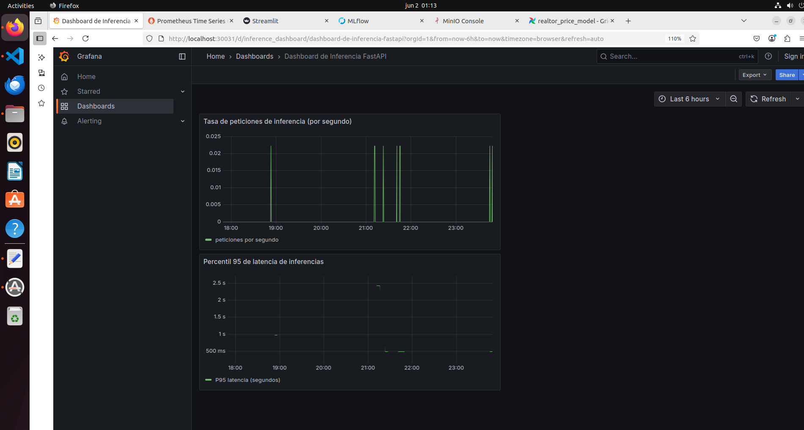

# Servicios en Servidor3

Este README describe en detalle cómo están organizados y desplegados los servicios en **Servidor3** dentro del proyecto `PROYECTO-MLOPS`.

---

## Distribución de archivos

```
├── README.md
├── fastapi\
│   ├── Dockerfile
│   ├── main.py
│   └── requirements.txt
├── grafana\
│   ├── Dockerfile
│   └── provisioning\
│       ├── dashboards.yml
│       └── datasources.yml
├── k8s\
│   ├── api-deployment.yaml
│   ├── api-service.yaml
│   ├── grafana-configmap.yaml
│   ├── grafana-dashboards-configmap.yaml
│   ├── grafana-deployment.yaml
│   ├── grafana-ini-overrides.yaml
│   ├── grafana-service.yaml
│   ├── kustomization.yaml
│   ├── prometheus-configmap.yaml
│   ├── prometheus-deployment.yaml
│   ├── prometheus-service.yaml
│   ├── streamlit-deployment.yaml
│   └── streamlit-service.yaml
├── kubeconfig-servidor3.yaml
├── prometheus\
│   ├── Dockerfile
│   └── prometheus.yml
└── streamlit\
    ├── Dockerfile
    ├── app.py
    └── requirements.txt
```

---

## 1. FastAPI (API de Predicción)

**Ruta:** `Servidor3/fastapi/`

### Contenido

- **Dockerfile**: Define la imagen Docker para la aplicación FastAPI.
- **main.py**: Contiene la lógica de la API, incluyendo el endpoint de predicción del modelo.
- **requirements.txt**: Lista las dependencias de Python para la aplicación FastAPI.

### Despliegue en Kubernetes

- **api-deployment.yaml**: Define el Deployment de Kubernetes para la aplicación FastAPI.
- **api-service.yaml**: Define el Service de Kubernetes para exponer la API de FastAPI.

## 2. Streamlit (Interfaz de Usuario)

**Ruta:** `Servidor3/streamlit/`






### Contenido

- **Dockerfile**: Define la imagen Docker para la aplicación Streamlit.
- **app.py**: Contiene la interfaz de usuario de Streamlit para interactuar con el modelo y mostrar resultados.
- **requirements.txt**: Lista las dependencias de Python para la aplicación Streamlit.

### Despliegue en Kubernetes

- **streamlit-deployment.yaml**: Define el Deployment de Kubernetes para la aplicación Streamlit.
- **streamlit-service.yaml**: Define el Service de Kubernetes para exponer la interfaz de Streamlit.

## 3. Prometheus (Monitoreo de Métricas)

**Ruta:** `Servidor3/prometheus/`



### Contenido

- **Dockerfile**: Define la imagen Docker para Prometheus.
- **prometheus.yml**: Archivo de configuración de Prometheus, especificando los objetivos a monitorear (ej. FastAPI).

### Despliegue en Kubernetes

- **prometheus-configmap.yaml**: ConfigMap para el archivo `prometheus.yml`.
- **prometheus-deployment.yaml**: Define el Deployment de Kubernetes para Prometheus.
- **prometheus-service.yaml**: Define el Service de Kubernetes para exponer la interfaz de Prometheus.

## 4. Grafana (Visualización de Métricas)

**Ruta:** `Servidor3/grafana/`




### Contenido

- **Dockerfile**: Define la imagen Docker para Grafana.
- **provisioning/**: Contiene configuraciones para datasources y dashboards de Grafana.
  - **dashboards.yml**: Configuración para el aprovisionamiento automático de dashboards.
  - **datasources.yml**: Configuración para el aprovisionamiento automático de fuentes de datos (ej. Prometheus).

### Despliegue en Kubernetes

- **grafana-configmap.yaml**: ConfigMap para la configuración de Grafana.
- **grafana-dashboards-configmap.yaml**: ConfigMap para los dashboards de Grafana.
- **grafana-ini-overrides.yaml**: ConfigMap para sobrescribir configuraciones de Grafana.
- **grafana-deployment.yaml**: Define el Deployment de Kubernetes para Grafana.
- **grafana-service.yaml**: Define el Service de Kubernetes para exponer la interfaz de Grafana.

## 5. Flujo de Datos y Conexiones

- La aplicación **FastAPI** expone un endpoint para las predicciones del modelo.
- La aplicación **Streamlit** consume la API de FastAPI para mostrar las predicciones y permitir la interacción del usuario.
- **Prometheus** recolecta métricas de la aplicación FastAPI (ej. latencia de solicitudes, número de solicitudes).
- **Grafana** se conecta a Prometheus como fuente de datos para visualizar las métricas en dashboards personalizados, proporcionando una visión en tiempo real del rendimiento del modelo y la API.

---

## 6. Pasos para el Despliegue

Para desplegar los servicios en Servidor3, sigue los siguientes pasos:

### 6.1. Configuración de Kubernetes

Asegúrate de tener un clúster de Kubernetes en funcionamiento y `kubectl` configurado para interactuar con él. Puedes usar `minikube`, `MicroK8s` o un clúster en la nube.

### 6.2. Aplicar Manifiestos de Kubernetes

Navega al directorio `Servidor3/k8s` y aplica todos los manifiestos de Kubernetes. Esto creará los Deployments, Services, ConfigMaps, etc., necesarios para todos los componentes (FastAPI, Streamlit, Prometheus, Grafana).

```bash
cd Servidor3/k8s
kubectl apply -f .
```

### 6.3. Verificar el Despliegue

Una vez aplicados los manifiestos, puedes verificar el estado de los pods y servicios:

```bash
kubectl get pods -n default
kubectl get services -n default
```

### 6.4. Acceder a los Servicios

- **FastAPI**: Accede a la API a través del Service de Kubernetes. Si estás usando `minikube` o `MicroK8s`, puedes usar `kubectl port-forward` o `minikube service <service-name> --url`.
- **Streamlit**: De manera similar, accede a la interfaz de Streamlit.
- **Prometheus**: Accede a la interfaz de usuario de Prometheus para verificar que las métricas se están recolectando.
- **Grafana**: Accede a la interfaz de usuario de Grafana. Deberías poder configurar Prometheus como fuente de datos y ver los dashboards preconfigurados (si se han aprovisionado correctamente).
